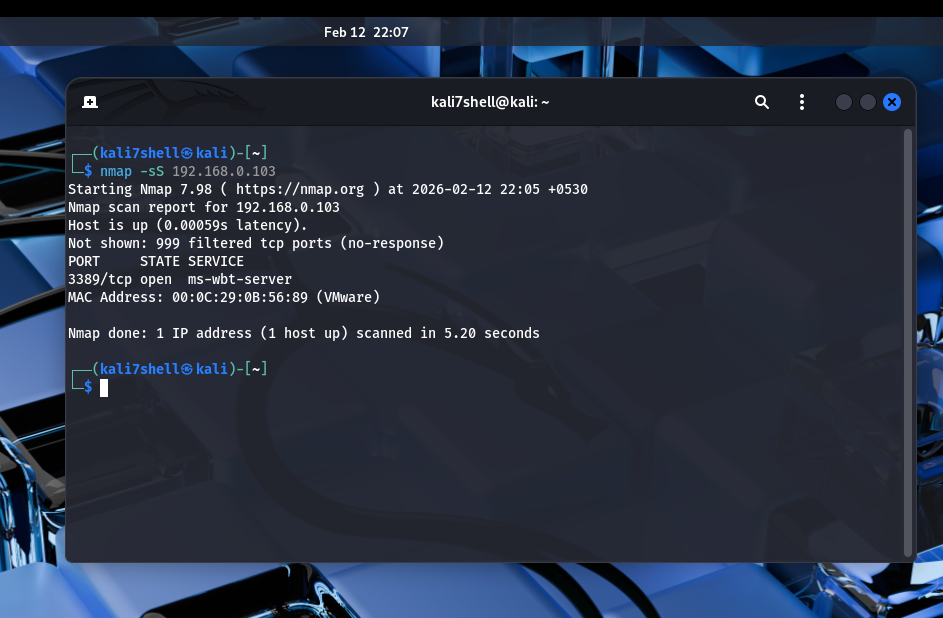
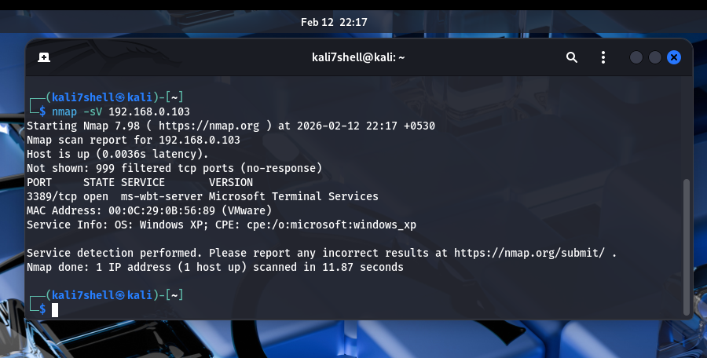

Network-Port-Scanning-Report
## Target: Windows XP Virtual Machine

---

## Introduction
Port scanning is a network reconnaissance technique used to identify open ports and services running on a system. In this task, a TCP SYN scan was performed on a Windows XP virtual machine using Nmap to identify exposed services and analyze potential risks.

---

## Lab Environment Setup
  - Attacker Machine: Kali Linux
  - Target Machine: Windows XP (Virtual Machine)
  - Network Configuration: Host-Only Adapter

---

## Identifying Target IP Address
To perform the scan, the IP address of the Windows XP machine was identified.
  - Open Command Prompt in Windows XP
  - Run: ipconfig
  - IPv4 Address: 192.168.0.103
**** Screen Shots ****

---

## Performing TCP SYN Scan
A TCP SYN scan was conducted using Nmap.
  - Command: nmap -sS 192.168.0.103
  -sS → TCP SYN scan (Stealth scan)
**** Screen Shots ****

---

## Service Analysis
Open Port Found:
Port 3389 - Remote Desktop Protocol (RDP)
It is used by Microsoft Remote Desktop Protocol (RDP). It allows remote access to the Windows system over a network.
Risks of Open Port 3389:
  - RDP is a common target for brute-force attacks.
  - Weak passwords can allow unauthorized remote access.
  - Attackers can gain full control of the system.
  - If exposed to the internet, it significantly increases the attack surface.

## Service Version Detection Using Nmap
To gather more detailed information about the services running on open ports, a version detection scan was performed using Nmap.
-sV enables service version detection
**** Screen Shots ****

---

## Saving Scan Results
  nmap -sS 192.168.0.103 -oN scan_results.txt
**** Screen Shots ****

---

Conclusion
During the scan of the Windows XP virtual machine, only one open port was identified — 3389 (RDP).  This port is used for Remote Desktop access, which allows someone to remotely connect and control the system.
Even though only one port was open, it can still be risky. RDP is commonly targeted by attackers for brute-force login attempts. If weak passwords are used or the service is not properly secured, an attacker could potentially gain unauthorized access to the system.

This task helped me understand how port scanning works and how even a single open port can increase the security risk of a system. It also showed why regular security checks and proper configuration are important to protect a network.

